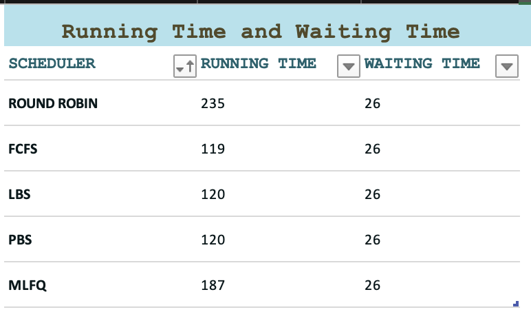
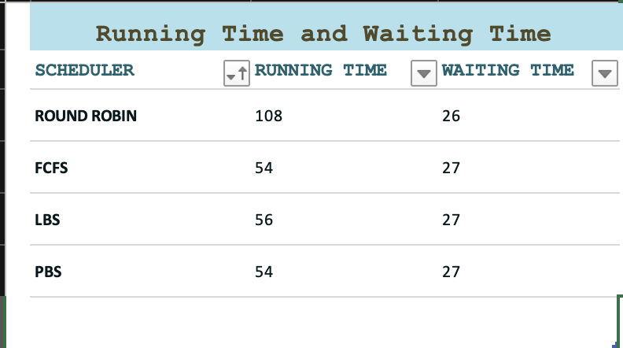

# Modified xv6 OS

## Sarthak Bansal | 2021101134

---

## Running OS

1. Install qemu
2. From the root directory of project, run 
```
make clean;
make qemu SCHEDULER={SCHEDULER} CPUS={CPUS};
```

- `SCHEDULER` can be one of the following:
  - `RR` (Round Robin) (Default)
  - `FCFS` (First Come First Serve)
  - `PBS` (Priority Based Scheduler)
  - `LBS` (Lottery Based Scheduler)
  - `MLFQ` (Multi Level Feedback Queue)


### First Come First Serve (FCFS)

- `Non-preemptive scheduling` : Disable pre-emption in usertrap and kerneltrap in kernel/trap.c
- `Always looks for process with lowest creation time` : 
     - Change the way process is chosen in scheduler() in proc.c
     - Add starttime of process in proc.h and initialise it in allocproc()

### Lottery Based Scheduler (LBS)
-  `Pre-emptive Scheduling`
-  `Set tickets` : 
    -  Each process is selected on the basis of number of tickets it has (defined in proc.h and initialised to 1 ) , process which has maximum tickets is scheduled first
    -  Add a system call `settickets` to SET number of tickets of the current process which can increase chances of scheduling of a process

### Priority Based Scheduler (PBS)

- `Non-Preemptive scheduling`
- `Dynamic Priority and Static Priority` :
    - Lower the value, higher the priority; if same priority , then number of times process is picked breaks the tie ; if that is also same , then starttime of process comes to rescue
    - Static priority initialised to 60
    - Dynamic priority is calculated using `niceness` and static priority
    $$dp = max(0, min(staticpriority - niceness + 5, 100))$$
    - `niceness` , which is initially 5 , is updated using a process' sleeping and running time in that quanta (calculated using a function update_times() in clockintr in trap.c after updating ticks)
    $$niceness=(10*sleeptime)/(sleeptime + runtime);$$
- Created a system call `set_priority` to change static priority of a process
- If priority increases , then process is rescheduled by making `num_picked` to 0

### Multi Level Feedback Queue (MLFQ)

- `Preemptive Scheduling`
- `5` queues are created :
    - `struct node` is defined which contains `struct proc*` and `struct node* next`
    - `NPROC` nodes are already created with empty processes
    - struct Queue contains `head` of queue and `size` of queue
    - Regular routines like `push` , `pop` , `remove` are implemented in proc.c
- For each process we have `queueno` , `inqueue` (to check whether a process is part of a queue) ,  `timeslice` ( time left in this queue ) and `qitime` (entry time in a queue to implement ageing)
- Process in queue _`i`_ gets _`2^i`_ ticks to run
- If a process spends more than certain number of ticks (ageing ticks) in a process , it is demoted to a lower queue (ageing) , implemented in scheduler
- Then  , process in the lowermost queueno is chosen and implemented
- If a process exhausts the timeslice in a queue and it's still Runnable, it gets demoted to lower priority (only if it's not already in the lowest) , implemented in `usertrap()` and `kerneltrap()` in trap.c

- **Exploitation:** A process can exploit this MLFQ algorithms by programming it to go to sleep for a small time just before it is about to exhaust the timeslice of top priority queue. This way it gets to stay on the top priority queue , thus causing large waiting time for processes in higher queues

## Average waiting and running Times for each Scheduling Algorithm
> Results were generating using waitx system call and schedulertest.c 

- Number of CPU = 1
    
  

- Number of CPU = 2



